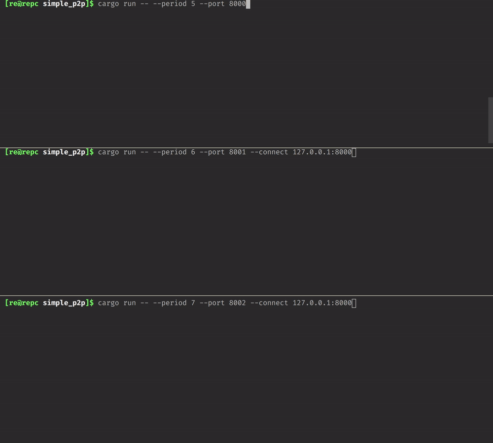

# Simple p2p

## How to run

You can do it simply via Cargo. Pass all necessary args after `--`, like that:

```
cargo run -- --period 5 --port 800
```

## Usage

```
[re@repc simple_p2p]$ cargo run -- --help
    Finished dev [unoptimized + debuginfo] target(s) in 0.11s
     Running `target/debug/simple_p2p -h`
simple_p2p 0.1.0
0x009922 <a.marcius26@gmail.com>
Simple implementation of peer-to-peer network

USAGE:
    simple_p2p [OPTIONS] --period <period> --port <port>

FLAGS:
    -h, --help       Prints help information
    -V, --version    Prints version information

OPTIONS:
        --connect <connect>    Sets the optional peer addr to connect to.
                                  Example: --connect 127.0.0.1:8000
        --period <period>      Sets the period (in seconds) of emitting messages to other peers.
                                  Example: --period 5
        --port <port>          Sets the port to listen to.
                                  Example: --port 8000
```

## Task summary

> Your task is to design a simple p2p gossiping application in Rust. The peer should have a cli interface to start it and connect itself to the other peers. Once connected, the peer should send a random gossip message to all the other peers every N seconds. The messaging period should also be specifiable in the command line. When a peer receives a message from the other peers, it should print it in the console.

## Demo

